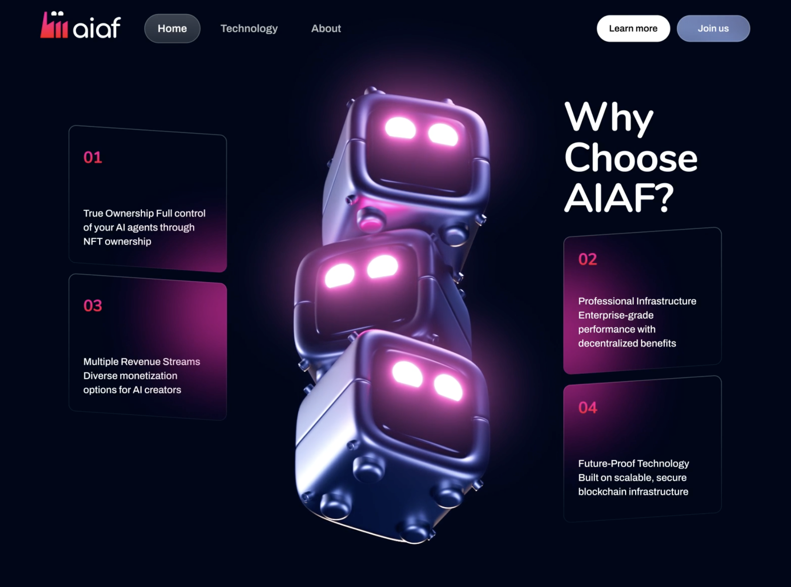

# Landing Page 4

## Assignment Overview
The goal of this assignment is to clone the landing page design shown below using **HTML** and **CSS**. Focus on creating a pixel-perfect replication of the layout, typography, and visual hierarchy.

## Reference Design

## Tech Stack
- **HTML5**: Use semantic elements for better structure.
- **CSS3**: Implement modern layout techniques (Flexbox/Grid).

## Requirements
- **Structure**: Ensure the HTML is semantically correct (use `<header>`, `<nav>`, `<section>`, `<footer>`, etc.).
- **Styling**: Match the colors, fonts, and spacing as closely as possible to the reference image.
- **Responsiveness**: (Optional) Make the design responsive for mobile and tablet devices.
- **Clean Code**: maintain organized and commented code files.

## How to Start
1. Create an `index.html` file.
2. Create a `style.css` file and link it to your HTML.
3. Analyze the image to break down the layout into large container blocks.
4. Start coding!